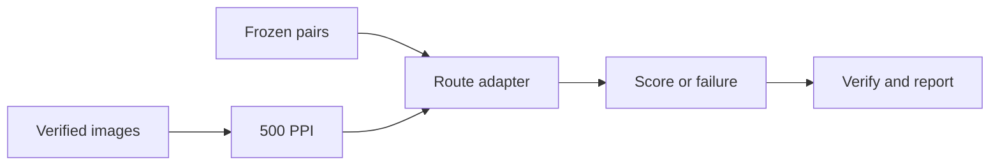

# fpbench — reproducible fingerprint verification benchmarks

[](https://github.com/Mish2000/fingerprint-benchmark/actions/workflows/tests.yml)
[](https://github.com/Mish2000/fingerprint-benchmark/actions/workflows/nbis-adapter.yml?query=event%3Aworkflow_dispatch+branch%3Amain)

A Python research harness that compares fingerprint verification routes on the
same planned image pairs, preserves scores and failures, and binds each result
to its data, configuration, executable and source revision.

**The six-route baseline comparison is complete.** It uses NIST SD300 A/B/C
source scans with a shared **500 PPI processing profile**. The contribution of
this repository is the experiment infrastructure, integrations and verifiable
evaluation; the external biometric algorithms are attributed individually below.

[Read the final results](evidence/final-baseline-tar-far-frr/final-baseline-report.md)
· [Understand the protocol](docs/experiments/final-baseline-pipeline-runbook.md)
· [Browse the stage history](docs/stage-history.md)

## What the project demonstrates

- **Experiment design:** frozen populations and pair manifests, explicit
  preprocessing, and separate score, decision and evaluation layers.
- **Integration engineering:** Python adapters around Java, native NBIS and
  OpenAFIS tools, a .NET MCC bridge and an isolated learned-model runtime.
- **Reliable execution:** deterministic planning, resumable execution,
  validated result bundles and explicit failure outcomes.
- **Reproducibility:** content hashes, runtime and source identities, evidence
  verifiers, synthetic contract tests and CI on Windows and Linux.



The harness owns image selection and comparison coverage. An adapter receives
the input pair without its ground-truth label; it cannot select the population
or choose an evaluation threshold.

## Completed comparison

Each route contributes **1,500 planned genuine comparisons and 73,500 planned
cross-subject impostor comparisons**, pooled across the three SD300 releases.
The cohort contains 50 subjects. The releases are related scans of the same
physical cards, so these are not three independent populations.

| Route | Implementation being evaluated |
|---|---|
| SourceAFIS Java 3.18.1 | External complete matcher, through a stateless Java bridge |
| NBIS MINDTCT 5.0.0 + BOZORTH3 | Official NIST extraction and matching tools, built from verified archives |
| FLX DeepPrint TexMinu 512 without localization | The specified FLX reproduction variant; not the original DeepPrint author system |
| VeriFinger 2025.2 | External proprietary SDK, through a local bridge |
| NBIS MINDTCT + MCC SDK v2.0 | Declared composition of the NIST extractor and the BioLab matcher |
| NBIS MINDTCT + OpenAFIS, capacity-extended | Declared composition with a separately identified capacity modification |

The [final report](evidence/final-baseline-tar-far-frr/final-baseline-report.md)
contains observed true-accept, false-accept and false-reject rates at the
predeclared FAR targets **1%, 0.1% and 0.01%**. It reports the primary
all-attempt view and the secondary common-score view, with counts and
denominators for each release and for the pooled set. Failed attempts remain
visible, including when a route cannot produce a score.

These are descriptive score sweeps over the recorded outcomes, not a calibrated
operational threshold or a population-level accuracy guarantee. Scores from
different matchers are never compared directly. The source scan resolution and
the shared processing resolution are distinct; this comparison does not establish
that a route uses anatomical Level-3 detail.

## Setup

Use a checkout with Git history for the source-provenance checks. The reference
development environment is Conda with Python 3.12; the core test workflow also
checks Python 3.11 and 3.13 on Windows and Linux.

```bash
git clone https://github.com/Mish2000/fingerprint-benchmark.git
cd fingerprint-benchmark
conda env create -f environment.yml
conda activate fingerprint-benchmark
python -m pip install -e ".[dev]"
python -m pytest -m "not dataset and not sourceafis and not full_run"
```

The last command is `make test`'s cross-platform equivalent. Tests that require
private data or external runtimes have explicit prerequisites; a reported skip
does not mean that integration was verified. Public CI does not rerun the private
SD300 experiment.

The committed final evidence can be checked **without datasets, model weights or
vendor SDKs**:

```bash
python scripts/stage21a_freeze.py --verify
python scripts/stage21b.py verify
python scripts/final_baseline.py verify
```

These commands verify the published evidence and report, not a new biometric run.
The [runbook](docs/experiments/final-baseline-pipeline-runbook.md) explains the
additional private inputs needed to reproduce the full execution.

### External integrations

- [SourceAFIS](integrations/sourceafis-java/README.md): Java bridge and adapter checks.
- [NBIS](integrations/nbis/README.md): official archives, Linux build and NIST's
  reference tests. Use `python scripts/fetch_nbis_archives.py` for current HTTP
  acquisition; the historical build script and archive digests are preserved.
- [Other routes](docs/stage-history.md): qualification, runtime, composition and
  artifact requirements for each completed or rejected candidate.

The separate NBIS workflow runs contract tests on relevant changes. Its manual
and weekly jobs also acquire NIST's archives, compile the tools and compare them
with NIST's reference outputs. The badge above tracks the manual upstream check
on `main`.

## Project map

| Path | Responsibility |
|---|---|
| `src/fpbench/` | Dataset and protocol contracts, adapters, execution, storage and evaluation |
| `integrations/` | External runtime bridges and verified acquisition/build tooling |
| `configs/` | Protocols, preprocessing profiles and route definitions |
| `tests/` | Contract, regression, integration and synthetic experiment checks |
| `evidence/` | Published aggregate reports, identities and verification markers |
| `docs/` | Architecture, ADRs, experiment runbooks and stage history |
| `workspace/` | Ignored local research inputs and execution artifacts |
| `V2/` | Historical exploratory high-resolution experiments, separate from the final baseline |

[Architecture and adapter contracts](docs/architecture/adding-an-algorithm.md)
· [Design decisions](docs/adr/README.md)
· [Published evidence index](evidence/README.md)

## Related research and scope

The historical [V2 L3 pilot](V2/experiments/l3_bridge_v1/README.md) and
[scale-repair study](V2/experiments/l3_bridge_scale_repair/README.md) retain their
own protocols and results. Focused Level-3 work continues in
[fingerprint-l3-benchmark](https://github.com/Mish2000/fingerprint-l3-benchmark);
it does not replace or reinterpret this completed 500 PPI comparison.

The [research project map](https://github.com/Mish2000/fingerprint-l3-benchmark/blob/main/docs/research-projects.md)
explains the four public repositories. This repository is the completed comparison
and experiment-infrastructure project. The
[ML/CV case study](https://github.com/Mish2000/fingerprint-new-method) covers
synthetic pore localization and its transfer limits; the
[software workbench](https://github.com/Mish2000/fingerprint-research) demonstrates
the API, user interface, storage and external-engine integration.

Developed by [Michael Sirkovich](https://github.com/Mish2000) as a personal
educational research project. Source code, weights, data and SDKs have separate
terms. This repository has no blanket software license; its own code retains
default copyright. Third-party archives, model weights, runtime bundles and
fingerprint imagery are obtained separately and are not redistributed here.
See the [research purpose](docs/policy/research-only-purpose.md),
[third-party usage policy](docs/policy/third-party-usage.md) and
[artifact handling policy](docs/policy/third-party-artifact-handling.md).
